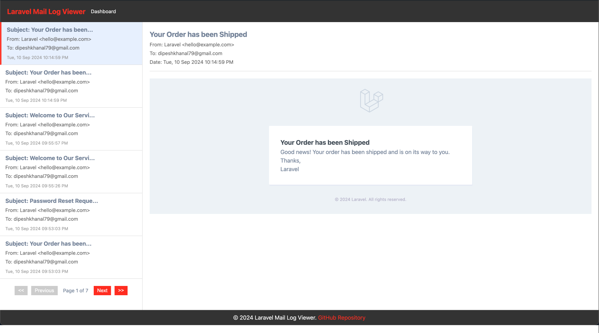

# Laravel Mail Log Viewer

[](https://packagist.org/packages/dipesh79/laravel-phonepe)
[](https://packagist.org/packages/dipesh79/laravel-phonepe)
[](https://packagist.org/packages/dipesh79/laravel-phonepe)

This Laravel package simplifies sending emails in local or staging environments, allowing you to easily view and test emails directly within the application.

## Quick Start

### Install Using Composer

```
composer require dipesh79/laravel-mail-log-viewer
```
## Official Documentation

Documentation can be found on my [website](https://khanaldipesh.com.np/package/laravel-mail-log-viewer).

## Demo


## License

[MIT](https://choosealicense.com/licenses/mit/)

## Author

- [@Dipesh79](https://www.github.com/Dipesh79)

## Support

For support, email dipeshkhanal79[at]gmail[dot]com.
